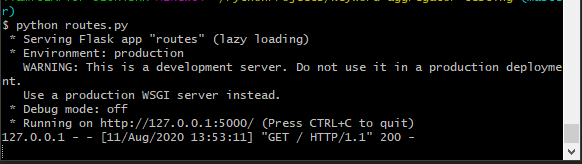
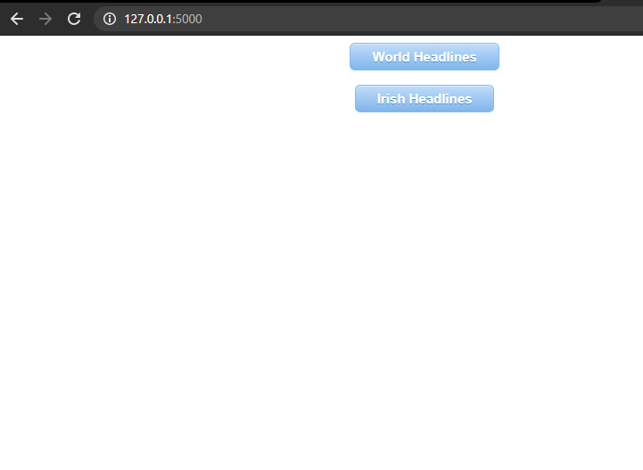
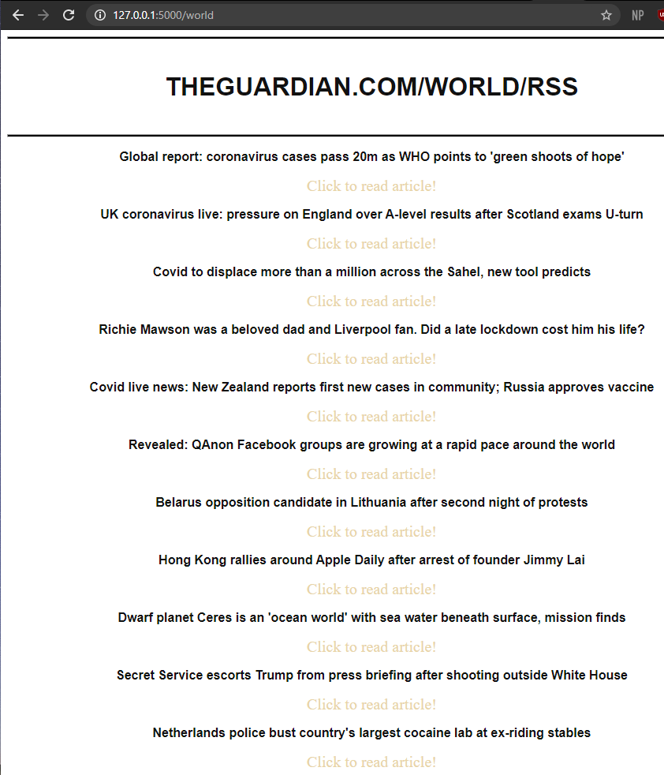

# RSS Feed aggregator 

This is Flask application that aggregates content from various RSS feeds. To run it, download the repo and ensure all required modules are installed. Then run `routes.py` in the working directory. 

Run the applicaiton like follows.

Then navigate to `http://127.0.0.1:5000/`

Clicking either button will redirect to a feed page.

Flask is used to manage the backend of the application (routing to different URLs and rendering HTML templates.) The `requests` library was used to make HTTP GET requests to various RSS feeds, and the `xml` library was used to parse the returned XML. 
